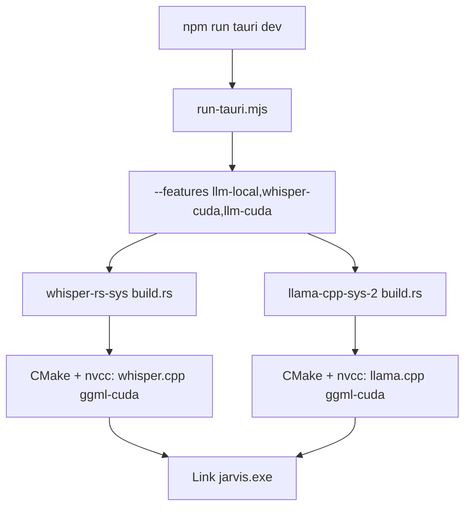
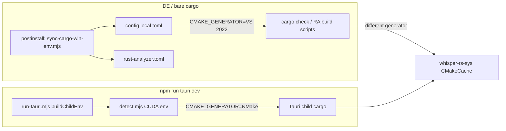

# GPU build time research and optimization plan

## Why builds feel so long

Your launcher already documents the core issue in `[jarvis/scripts/whisper-gpu/preflight.mjs](jarvis/scripts/whisper-gpu/preflight.mjs)`:

> first GPU dev build compiles CUDA for **whisper-rs-sys** and **llama-cpp-sys** — often **45–90+ minutes** on Windows

This is not a Rust/Tauri bug — it is **two independent CMake + nvcc compiles** of ggml’s CUDA backend (~hundreds of `.cu` files each), triggered every time you cold-build or invalidate the CMake cache.




### Contributing factors (ranked by impact)


| Factor                                | Impact                                                                | Your repo today                                                                                                     |
| ------------------------------------- | --------------------------------------------------------------------- | ------------------------------------------------------------------------------------------------------------------- |
| **Two full CUDA native builds**       | Dominant (~2× cost vs one)                                            | `[run-tauri.mjs](jarvis/scripts/whisper-gpu/run-tauri.mjs)` always adds `llm-local` + matched `whisper-`* / `llm-`* |
| **No prebuilt whisper/llama libs**    | Every cold build compiles from source                                 | Unlike `ort` (`download-binaries` in `[Cargo.toml](jarvis/src-tauri/Cargo.toml)`)                                   |
| **Windows NMake generator for CUDA**  | High — `.cu` files often compile **serially** with MSVC toolchain     | `[detect.mjs](jarvis/scripts/whisper-gpu/detect.mjs)` pins `CMAKE_GENERATOR=NMake Makefiles`                        |
| **Multi-GPU-arch nvcc defaults**      | Medium — compiles virtual SASS for many generations + real for recent | No `CMAKE_CUDA_ARCHITECTURES` set; ggml defaults when `GGML_NATIVE=OFF` (llama) can target 50–89                    |
| **CMake cache invalidation**          | Medium — full 30–90 min **re**build                                   | VS 2022 (rust-analyzer / `cargo check`) vs NMake (`tauri dev`) mismatch; tracked `CMAKE` in config                  |
| **bindgen on both `-sys` crates**     | Low–medium on first build                                             | whisper-rs-sys always runs bindgen unless `WHISPER_DONT_GENERATE_BINDINGS=1`                                        |
| **Llama FlashAttention CUDA kernels** | Medium compile, good runtime                                          | `GGML_CUDA_FA=ON` by default in current llama.cpp (observed in prior local CMakeCache)                              |


**After cache is warm:** incremental dev ~**1–2 min** (`[README.md](jarvis/README.md)`) — so the pain is almost entirely **first build + accidental cache wipes**.

---

## Environment setup — how it works and what hurts

Jarvis uses **four independent env layers** that do not always agree. Several of these directly cause **full 30–90 min rebuilds** even when source did not change.




### Env source map (your machine today)


| Variable                         | `npm run tauri dev` (CUDA)                                                              | `npm run cargo` / rust-analyzer                                                                                                                    | Notes                                                                      |
| -------------------------------- | --------------------------------------------------------------------------------------- | -------------------------------------------------------------------------------------------------------------------------------------------------- | -------------------------------------------------------------------------- |
| `CMAKE_GENERATOR`                | **NMake Makefiles** via `[detect.mjs](jarvis/scripts/whisper-gpu/detect.mjs)`           | **Visual Studio 17 2022** via `[config.local.toml](jarvis/src-tauri/.cargo/config.local.toml)` + `[rust-analyzer.toml](jarvis/rust-analyzer.toml)` | **Primary rebuild trigger**                                                |
| `CMAKE_CUDA_COMPILER`            | `{CUDA_PATH}\bin\nvcc.exe`                                                              | Not set in sync                                                                                                                                    | RA/bare cargo lacks nvcc path unless shell has it                          |
| `CMAKE_CUDA_HOST_COMPILER`       | MSVC `cl.exe`                                                                           | Not set                                                                                                                                            | Same                                                                       |
| `CMAKE_CUDA_FLAGS`               | `-Xcompiler=/Zc:preprocessor`                                                           | Not set                                                                                                                                            | Windows CUDA + MSVC preprocessor fix                                       |
| `CMAKE_CUDA_ARCHITECTURES`       | **Not set anywhere**                                                                    | **Not set**                                                                                                                                        | Falls through to ggml multi-arch defaults                                  |
| `CMAKE_BUILD_PARALLEL_LEVEL`     | Not set in launcher                                                                     | Not set                                                                                                                                            | llama-cpp-sys-2 sets internally; whisper-rs-sys does not                   |
| `CUDA_PATH`                      | Auto-discovered (latest under `Program Files\NVIDIA GPU Computing Toolkit\CUDA`)        | Shell only                                                                                                                                         | `[detect.mjs](jarvis/scripts/whisper-gpu/detect.mjs)` picks newest version |
| `LIBCLANG_PATH`                  | Set by `[win-env.mjs](jarvis/scripts/whisper-gpu/win-env.mjs)`                          | Same via sync                                                                                                                                      | `C:\Program Files\LLVM\bin` on your box                                    |
| `BINDGEN_EXTRA_CLANG_ARGS`       | MSVC + Win SDK `-isystem` paths                                                         | Same via sync                                                                                                                                      | Short 8.3 paths in generated config                                        |
| `WHISPER_DONT_GENERATE_BINDINGS` | Not set                                                                                 | Not set                                                                                                                                            | bindgen runs every whisper-rs-sys build                                    |
| `CMAKE`                          | `cmake` from PATH (`force=false` in [config.toml](jarvis/src-tauri/.cargo/config.toml)) | Same                                                                                                                                               | Tracked config correctly avoids pinning a bad path                         |


### Confirmed env problems affecting build time

**1. Split-brain `CMAKE_GENERATOR` (high impact)**

- `[sync-cargo-win-env.mjs](jarvis/scripts/sync-cargo-win-env.mjs)` runs on `**npm install`** and writes `CMAKE_GENERATOR = "Visual Studio 17 2022"` into `config.local.toml` and `rust-analyzer.toml`.
- `[run-tauri.mjs](jarvis/scripts/whisper-gpu/run-tauri.mjs)` overrides process env to **NMake** for CUDA, and deliberately skips injecting VS when CUDA is active (lines 103–105).
- Cargo precedence: **process env wins** for `tauri dev`, but **config.local.toml wins** for bare `cargo check` / rust-analyzer when the shell has no `CMAKE_GENERATOR`.
- **Effect:** Any IDE `cargo check` that touches `whisper-rs-sys` builds with VS; next `tauri dev` uses NMake → CMake cache invalid → **full whisper-rs-sys CUDA rebuild**. `[preflight.mjs](jarvis/scripts/whisper-gpu/preflight.mjs)` warns and can auto-clear whisper cache on mismatch, but only for `whisper-rs-sys-*`, **not `llama-cpp-sys-2-*`**.

**2. Stale `CMAKE_GENERATOR` in user shell (medium impact, easy to miss)**

`[detect.mjs](jarvis/scripts/whisper-gpu/detect.mjs)` line 154:

```js
if (!envObj.CMAKE_GENERATOR) envObj.CMAKE_GENERATOR = "NMake Makefiles";
```

If your terminal or system env already has `CMAKE_GENERATOR=Visual Studio 17 2022` (common after VS dev prompts, CMake GUI, or copying docs), **CUDA builds keep VS** and never switch to NMake/Ninja — nvcc integration may be suboptimal or CMake may reconfigure repeatedly. Launcher should **force** CUDA generator when `whisper-cuda`/`llm-cuda` are active, not only set when unset.

**3. rust-analyzer + parallel tauri dev (medium impact)**

- `[preflight.mjs](jarvis/scripts/whisper-gpu/preflight.mjs)` blocks when `.cargo-lock` is held by a live cargo process — good.
- When RA finishes a VS-based `-sys` build and you start `tauri dev`, you pay a full rebuild even without simultaneous builds.
- **Mitigation in plan:** unify generator across IDE + tauri (Phase B), or document disabling RA `cargo check` for `-sys` crates during GPU bring-up.

**4. `cargo-win-env.mjs` CUDA gap (low–medium)**

`[cargo-win-env.mjs](jarvis/scripts/cargo-win-env.mjs)` only applies CUDA env when args contain `whisper-cuda`, **not** `llm-cuda` alone. `npm run test:cargo-whisper-cuda` is covered; any future `llm-cuda`-only check would build llama with VS + no nvcc paths.

**5. Missing launcher-level CUDA tuning (medium)**

Neither `[detect.mjs](jarvis/scripts/whisper-gpu/detect.mjs)` nor sync writes:

- `CMAKE_CUDA_ARCHITECTURES` (RTX 40 should be `89`)
- `CMAKE_BUILD_PARALLEL_LEVEL` for whisper-rs-sys
- `WHISPER_DONT_GENERATE_BINDINGS`

These are the highest-ROI additions to the **shared** tauri/cargo-win-env path.

**6. What is already correct**

- `[config.toml](jarvis/src-tauri/.cargo/config.toml)`: `CMAKE = { force = false }` — avoids cache-busting CMake path pins (comment documents 30+ min rebuild risk).
- `[run-tauri.mjs](jarvis/scripts/whisper-gpu/run-tauri.mjs)`: CUDA PATH prepend for `nvcc` + CUPTI.
- `[win-env.mjs](jarvis/scripts/whisper-gpu/win-env.mjs)`: bindgen preflight exits early before long CUDA compile.
- Include chain: `[jarvis/.cargo/config.toml](jarvis/.cargo/config.toml)` → `src-tauri/.cargo/config.toml` → `config.local.toml`.

### Env-related plan additions (Phase E)

Add to implementation before/alongside Phase A:

1. **Force CUDA generator** in `applyWindowsCudaBuildEnvIfNeeded` when GPU features are on — overwrite shell `CMAKE_GENERATOR`, log if changed.
2. **Extend** `clearWhisperRsSysBuildCacheOnGeneratorMismatch` → both `whisper-rs-sys-*` and `llama-cpp-sys-2-*` (rename to `clearGpuSysCmakeCacheOnGeneratorMismatch`).
3. **Update `sync-cargo-win-env.mjs`:** either stop writing `CMAKE_GENERATOR` when `JARVIS_CUDA_DEV=1`, or write the same generator Ninja/NMake as tauri CUDA (Phase B).
4. **Update `cargo-win-env.mjs`:** treat `llm-cuda` like `whisper-cuda` for CUDA env injection.
5. **Add `scripts/diagnose-build-env.mjs`** (read-only): print effective generator, CUDA_PATH, arch, whether whisper/llama ggml-cuda artifacts exist, and flag generator mismatch — for debugging “why is it rebuilding?”.

---

## Best practices (research-backed)

### 1. Pin CUDA architecture to your GPU (RTX 40 → `89`)

[llama.cpp build docs](https://github.com/ggml-org/llama.cpp/blob/master/docs/build.md) and [NVIDIA nvbench guidance](https://github.com/NVIDIA/nvbench/discussions/129): compiling for `"50-virtual;…;89-real"` is far slower than a single arch.

Both `-sys` crates forward `CMAKE`_* env vars to CMake:

- whisper-rs-sys: [`build.rs` lines 256–264](file in cargo registry) — `CMAKE`** and `WHISPER`**
- llama-cpp-sys-2: [`build.rs` lines 538–540](file in cargo registry) — `CMAKE`_*

**Recommendation for your RTX 40-series:**

```text
CMAKE_CUDA_ARCHITECTURES=89
```

Optional PTX forward-compat: `89-real` (slightly larger build, safer across driver updates). Avoid `native` in CI; fine for solo dev if GPU is fixed.

**Expected savings:** often **30–50%** off nvcc time vs multi-arch defaults (varies by ggml version).

### 2. Parallelize CUDA compilation on Windows (biggest win after arch pin)

Research consensus ([OpenCV #15135](https://github.com/opencv/opencv/issues/15135), [cmake-rs #241](https://github.com/rust-lang/cmake-rs/issues/241), [OpenCV #24382](https://github.com/opencv/opencv/pull/24382)):

- **NMake / MSBuild:** `.cu` files frequently compile **one at a time** → low CPU/GPU compiler utilization (~20% nvcc).
- **Ninja:** parallel task graph → **~4–6× faster** CUDA builds on Windows in reported benchmarks.
- `**CMAKE_BUILD_PARALLEL_LEVEL`:** llama-cpp-sys-2 already sets this from CPU count; whisper-rs-sys does **not** — set it in launcher env for both.

**Recommendation:** evaluate switching CUDA path from NMake to **Ninja** in `[detect.mjs](jarvis/scripts/whisper-gpu/detect.mjs)`:

```text
CMAKE_GENERATOR=Ninja
CMAKE_MAKE_PROGRAM=<path to ninja.exe>   # winget install Ninja-build.Ninja
CMAKE_BUILD_PARALLEL_LEVEL=<cpu cores>
```

Keep the same `CMAKE_CUDA_COMPILER` / `CMAKE_CUDA_HOST_COMPILER` (nvcc + cl.exe). Requires one-time validation on your CUDA 13.2 + VS 2022 setup; if Ninja fails, fall back to NMake with `CMAKE_BUILD_PARALLEL_LEVEL` only.

### 3. Compiler result caching (ccache / sccache)

[Arpad Voros whisper-rs guide](https://arpadvoros.com/posts/2026/05/05/speeding-up-rust-whisper-rs-build-times/) and [llama-cpp-rs changelog](https://github.com/eugenehp/llama-cpp-rs/blob/main/CHANGELOG.md) (newer fork): set CMake compiler launchers:

```text
CMAKE_C_COMPILER_LAUNCHER=ccache
CMAKE_CXX_COMPILER_LAUNCHER=ccache
CMAKE_CUDA_COMPILER_LAUNCHER=ccache   # if ccache CUDA backend configured
```

**Helps most on:** rebuilds after `cargo clean`, feature toggles, dependency bumps — not the very first nvcc compile. llama-cpp-sys-2 (your version) lacks the built-in sccache auto-detect that llama-cpp-sys-4 added; wire it via env in the launcher.

### 4. Skip whisper bindgen when possible

whisper-rs-sys supports:

```text
WHISPER_DONT_GENERATE_BINDINGS=1
```

Uses bundled `bindings.rs` — saves bindgen time and avoids Windows SDK include fragility. Safe when not changing whisper.cpp FFI. Set via `[detect.mjs](jarvis/scripts/whisper-gpu/detect.mjs)` / `[win-env.mjs](jarvis/scripts/whisper-gpu/win-env.mjs)` for `tauri dev` paths.

### 5. Prevent accidental full rebuilds (workflow)

Already documented; enforce in tooling:

- **Never** alternate bare `cargo check` (VS 2022 generator in `[config.local.toml](jarvis/src-tauri/.cargo/config.local.toml)`) with `npm run tauri dev` (NMake/Ninja CUDA) without cleaning — `[preflight.mjs](jarvis/scripts/whisper-gpu/preflight.mjs)` warns but could auto-clear or block.
- **Do not** pin `CMAKE` in tracked `[.cargo/config.toml](jarvis/src-tauri/.cargo/config.toml)` (comment already warns).
- **One** cargo/tauri process at a time (`.cargo-lock`).
- After warm cache: stay on `npm run tauri dev` for Rust iteration.

### 6. Prebuilt native libs (CI / team onboarding)

[whisper-cpp-plus-rs caching guide](https://github.com/operator-kit/whisper-cpp-plus-rs/blob/main/docs/CACHING_GUIDE.md): precompile once, link in <1s on subsequent builds via `WHISPER_PREBUILT_PATH`.

**whisper-rs 0.14 does not ship this** — options:

- Add a **repo script** `scripts/prebuild-gpu-libs.mjs` that runs CMake once per backend/arch and sets env vars for cargo (custom, but high ROI for CI).
- Or migrate to a crate with official prebuild xtask (larger API change).

No equivalent for llama-cpp-sys-2 in-tree; same custom prebuild script could emit static libs for both.

---

## Lightweight dependencies — do you need them?

You chose **both GPU backends in dev** — swapping engines is a product decision, not the first lever. Summary:


| Component  | Current                         | Lighter option                                   | Tradeoff                                                                    |
| ---------- | ------------------------------- | ------------------------------------------------ | --------------------------------------------------------------------------- |
| Wake word  | `ort` + prebuilt binaries       | Already optimal                                  | —                                                                           |
| STT        | `whisper-rs` → whisper.cpp CUDA | ORT models (Moonshine/SenseVoice via `ort/cuda`) | Faster builds (prebuilt ORT), different accuracy/API; still CUDA at runtime |
| STT        | whisper-rs CUDA                 | `tauri:dev:cpu` / Vulkan                         | CPU slower inference; Vulkan avoids nvcc                                    |
| LLM router | `llama-cpp-2` 0.5B Q4           | Remote API / rules-only tier1                    | Removes llama-cpp-sys compile entirely                                      |
| LLM        | llama-cpp-sys-2                 | llama-cpp-sys-4 fork (utilityai/eugenehp)        | **Build-cache improvements** but migration cost; same runtime stack         |


**Duplicate ggml:** whisper and llama each embed ggml — **cannot dedupe** without a shared system-ggml build (`LLAMA_USE_SYSTEM_GGML` / custom pipeline). Not practical short-term.

**Verdict:** Keep whisper-rs + llama-cpp-2 for your goals; optimize the **build pipeline** first. Revisit ORT-STT only if you want to drop whisper.cpp CUDA entirely.

---

## Recommended implementation (phased)

### Phase E — Environment hardening (do first)

1. Force CUDA `CMAKE_GENERATOR` over stale shell/config in `[detect.mjs](jarvis/scripts/whisper-gpu/detect.mjs)`.
2. Extend `[preflight.mjs](jarvis/scripts/whisper-gpu/preflight.mjs)` cache clear/warn to **llama-cpp-sys-2** as well as whisper.
3. Fix `[cargo-win-env.mjs](jarvis/scripts/cargo-win-env.mjs)` to apply CUDA env for `llm-cuda` features.
4. Add `scripts/diagnose-build-env.mjs` for one-command env/cache inspection.
5. Document in README: **do not** set global `CMAKE_GENERATOR` in Windows user env if using GPU tauri builds.

### Phase A — Quick wins (low risk, ~1–2 files)

Edit `[detect.mjs](jarvis/scripts/whisper-gpu/detect.mjs)` `applyWindowsCudaBuildEnvIfNeeded` and wire same vars through `[run-tauri.mjs](jarvis/scripts/whisper-gpu/run-tauri.mjs)` / `[cargo-win-env.mjs](jarvis/scripts/cargo-win-env.mjs)`:

1. Set `CMAKE_CUDA_ARCHITECTURES=89` (document override env `JARVIS_CUDA_ARCH`).
2. Set `CMAKE_BUILD_PARALLEL_LEVEL` from `os.cpus().length` (whisper + llama).
3. Set `WHISPER_DONT_GENERATE_BINDINGS=1` for tauri launcher paths.
4. Log active CUDA build profile at startup (arch, generator, parallel level, CUDA_PATH).

Update `[README.md](jarvis/README.md)` with RTX 40 arch table, env layer diagram, and override instructions.

### Phase B — Ninja CUDA generator (medium risk, high reward)

1. Detect `ninja.exe` on PATH; prefer Ninja over NMake when CUDA build runs.
2. Update `[preflight.mjs](jarvis/scripts/whisper-gpu/preflight.mjs)` generator mismatch logic for Ninja.
3. Update `[sync-cargo-win-env.mjs](jarvis/scripts/sync-cargo-win-env.mjs)` so rust-analyzer uses **same generator** as tauri CUDA (or document “use `npm run cargo` for CUDA checks only”).
4. Benchmark: one clean `whisper-rs-sys` + `llama-cpp-sys-2` build NMake vs Ninja; record wall time.

**Fallback:** env `JARVIS_CMAKE_GENERATOR=NMake Makefiles` restores current behavior.

### Phase C — ccache/sccache (optional)

1. Document `winget install ccache` (or sccache).
2. In `detect.mjs`, if `ccache` on PATH, set compiler launcher env vars.
3. Add `jarvis/.cache/ccache` to `.gitignore`.

### Phase D — Prebuild script for CI / fresh clones (optional)

New `[jarvis/scripts/prebuild-gpu-cuda.mjs](jarvis/scripts/prebuild-gpu-cuda.mjs)`:

- Run CMake Release builds for whisper.cpp + llama.cpp with pinned arch 89.
- Cache artifacts under `jarvis/.cache/gpu-prebuild/<arch>/`.
- Wire `WHISPER`_* / custom env so `-sys` crates skip full compile when cache hit.

This is the closest match to industry practice ([whisper-cpp-plus-rs xtask](https://github.com/operator-kit/whisper-cpp-plus-rs)) without changing Rust deps.

---

## Realistic expectations (RTX 40, both CUDA)


| Scenario                   | Before              | After Phase A+B (estimate)                  |
| -------------------------- | ------------------- | ------------------------------------------- |
| First cold GPU dev build   | 45–90+ min          | **20–45 min** (arch pin + Ninja + parallel) |
| Incremental `tauri dev`    | ~1–2 min            | ~1–2 min (unchanged)                        |
| Generator mismatch rebuild | 45–90+ min again    | Avoided via consistent Ninja + preflight    |
| `cargo clean`              | Full CUDA recompile | ccache reduces if Phase C enabled           |


**Cannot eliminate** the fundamental cost of compiling two ggml-cuda trees without prebuilt libs or dropping a backend.

---

## Validation checklist

1. Clean build: `npm run cargo -- clean` then `npm run tauri:dev:gpu` — time to `jarvis.exe` launch.
2. Incremental: touch one Rust file — rebuild < 2 min.
3. `nvidia-smi` during compile — GPU util should rise with Ninja (vs flat with NMake).
4. Runtime: Whisper STT + LLM router inference on GPU (Settings shows CUDA available).
5. Run existing `npm run test:cargo-whisper-cuda` after generator changes.

---

## Files to touch

- `[jarvis/scripts/whisper-gpu/detect.mjs](jarvis/scripts/whisper-gpu/detect.mjs)` — arch pin, parallel level, bindgen skip, force CUDA generator, Ninja detection
- `[jarvis/scripts/whisper-gpu/preflight.mjs](jarvis/scripts/whisper-gpu/preflight.mjs)` — generator mismatch for whisper **and** llama
- `[jarvis/scripts/whisper-gpu/run-tauri.mjs](jarvis/scripts/whisper-gpu/run-tauri.mjs)` — pass unified CUDA env to Tauri child
- `[jarvis/scripts/cargo-win-env.mjs](jarvis/scripts/cargo-win-env.mjs)` — `llm-cuda` CUDA env parity
- `[jarvis/scripts/sync-cargo-win-env.mjs](jarvis/scripts/sync-cargo-win-env.mjs)` — align or isolate IDE generator from CUDA tauri path
- `[jarvis/scripts/whisper-gpu/win-env.mjs](jarvis/scripts/whisper-gpu/win-env.mjs)` — bindgen skip env
- `[jarvis/scripts/diagnose-build-env.mjs](jarvis/scripts/diagnose-build-env.mjs)` — new env diagnostic script
- `[jarvis/README.md](jarvis/README.md)` — env layers, rebuild triggers, Ninja/ccache, arch override
- Optional: `[jarvis/scripts/prebuild-gpu-cuda.mjs](jarvis/scripts/prebuild-gpu-cuda.mjs)`, `.gitignore` cache dirs

**No Cargo.toml dependency changes required** for Phases A–E.