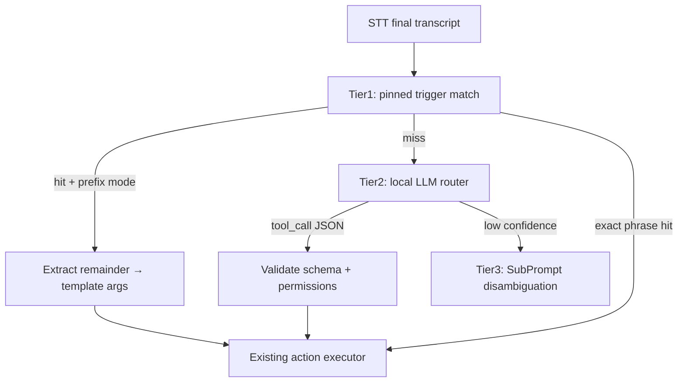
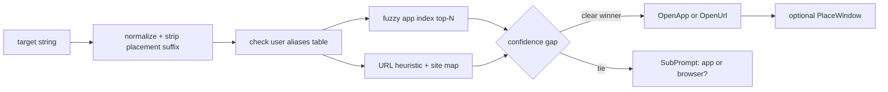

# Intelligent command routing with on-device LLM + user tools

## Current state (what we can reuse)

Jarvis already has most of the **execution** layer; it lacks **semantic routing**.

| Layer | Exists today | Gap |
|-------|----------------|-----|
| STT | Whisper local/GPU, remote BYOK | No LLM after text |
| Match | Substring/fuzzy trigger phrases ([`matcher.rs`](jarvis/src-tauri/src/commands/matcher.rs)) | No slots, no NLU |
| Span | `span_start` / `span_end` computed | Remainder never passed to executor ([`lib.rs`](jarvis/src-tauri/src/lib.rs) ~L1013) |
| Actions | `OpenApp`, `OpenUrl`, `SendKeys`, `Speak`, `Wait`, `SubPrompt`, `RunScript` ([`models.rs`](jarvis/src-tauri/src/db/models.rs)) | These **are** tools — just not exposed to a model |
| App resolve | Fuzzy `resolve_app` @ 0.75 ([`apps/mod.rs`](jarvis/src-tauri/src/apps/mod.rs)) | Only uses static DB `name`, not spoken remainder |
| Inference stack | `ort` (wake), `whisper-rs`, Piper ONNX | Explicit comment: *"No LLM — audio → text only"* ([`transcription/mod.rs`](jarvis/src-tauri/src/audio/transcription/mod.rs)) |

**Key insight:** your idea does not require replacing the executor. Add a **Tool Registry** + **Router** in front of [`execute_command`](jarvis/src-tauri/src/commands/executor.rs). User-authored tools compile to the same action chains you already edit in [`CommandFormulaRow.tsx`](jarvis/src/components/editor/CommandFormulaRow.tsx).

---

## Recommended architecture: tiered routing

Use **three tiers** so common commands stay instant while free-form speech still works.



| Tier | Latency target | When |
|------|----------------|------|
| **1 — Pinned commands** | ~0 ms (after existing 550 ms STT debounce) | User-defined triggers like `"open"` with remainder, or exact phrases like `"lock screen"` |
| **2 — LLM router** | ~150–600 ms on-device | Anything natural: `"put brave on the left"`, `"open github"`, multi-step intent |
| **3 — Clarify** | +1 listen cycle | Ambiguous app/URL, confidence below threshold |

Tier 1 is cheap insurance: power users keep deterministic macros; the LLM handles the long tail.

---

## On-device model strategy

### Model choice (Windows-first, matches existing GPU story)

Target **small instruct models** quantized Q4 (~400 MB–1.2 GB):

- **Qwen2.5-0.5B-Instruct** or **1.5B** — strong tool-calling at tiny size
- **Llama-3.2-1B-Instruct** — good structured JSON
- **Phi-3.5-mini-instruct** — slightly larger, very reliable JSON

Avoid bundling a big model initially; download-on-first-use like Whisper weights ([`download-model.ps1`](jarvis/scripts/download-model.ps1)).

### Runtime (Rust / Tauri)

Mirror the Whisper feature-flag pattern in [`Cargo.toml`](jarvis/src-tauri/Cargo.toml):

- New optional feature: `llm-local` → **`llama-cpp-2`** (or `candle` if you prefer pure Rust)
- GPU backends: reuse CUDA/Vulkan/Metal flags already used for Whisper
- Warmup at startup (same UX as [`whisper_gpu_status`](jarvis/src/components/Settings/SettingsPanel.tsx)) — optional setting `"Warm router model on launch"`

### Structured output (critical for reliability)

Do **not** rely on free-form chat. Constrain generation:

1. Build a **tool catalog prompt** from enabled user tools (name + description + JSON Schema params)
2. Ask model for **one JSON object**: `{ "tool": "...", "args": { ... }, "confidence": 0.0-1.0 }`
3. Parse with strict schema validation (`serde_json` + manual checks)
4. Reject / clarify if `confidence < threshold` (default 0.7) or schema invalid

Optional later: grammar-constrained decoding (llama.cpp `grammar`) for near-zero invalid JSON.

### Latency budget

Current flow already waits **550 ms silence** ([`SILENCE_BEFORE_MATCH`](jarvis/src-tauri/src/lib.rs)) before matching — LLM inference fits inside that perceived pause if model is warm.

| Step | Budget |
|------|--------|
| STT debounce | 550 ms (existing) |
| LLM router (1B Q4, GPU) | 100–400 ms |
| Tool validation + execute | 10–50 ms |
| **Total perceived** | ~600–1000 ms — acceptable for voice |

Show HUD state `"Understanding…"` during Tier 2 (reuse `executing` / new `routing` phase).

---

## User-defined tools (the product surface)

Introduce a **Tools** concept distinct from but related to **Commands**.

### Data model (new SQLite table `tools`)

```rust
ToolDefinition {
  id, name,                    // machine id: "open_target"
  display_name,                // "Open app or site"
  description,                 // shown to LLM: "Opens an installed app or browser URL from a spoken name"
  parameters: JsonSchema,      // { "target": "string", "placement": "enum?" }
  actions: Vec<Action>,         // same enum as today, with {{target}}, {{placement}} templates
  enabled: bool,
  builtin: bool,               // shipped tools vs user-created
}
```

**Commands** become one authoring path:

- **Classic command** = tool + fixed trigger phrase (Tier 1 only)
- **Tool-only** = no trigger; LLM can invoke anytime (Tier 2)

This unifies the editor: [`CommandFormulaRow`](jarvis/src/components/editor/CommandFormulaRow.tsx) grows a **"Expose as tool"** toggle + parameter schema fields.

### Built-in tools (ship first)

| Tool | Args | Maps to |
|------|------|---------|
| `open_target` | `target`, optional `placement` | Smart resolver → `OpenApp` / `OpenUrl` + future `PlaceWindow` |
| `open_url` | `url` | `OpenUrl` |
| `send_keys` | `keys` | `SendKeys` |
| `speak` | `text` | `Speak` |
| `snap_window` | `zone` (left/right/max/…) | New Win32 placement action |
| `run_user_script` | `script_id`, `args` | Sandboxed `RunScript` registry |

Power users add tools like:

- `"deploy_staging"` → `RunScript` + `Speak("Deploying")`
- `"focus_slack"` → `OpenApp` with fixed path + `focus_existing: true`

### Custom tool authoring UX (new editor tab or section)

- **Name + description** (description quality directly affects LLM accuracy — show tips)
- **Parameters builder**: add string/enum/boolean slots
- **Action chain builder**: reuse existing formula UI; autocomplete `{{param_name}}` alongside `{{follow_up}}` / `Variable N`
- **Test panel**: type utterance → show Tier 1/2 routing decision + resolved args (no mic needed)

---

## Smart `open_target` tool (replaces bespoke remainder parser)

Instead of hardcoding `"open" + remainder`, make **`open_target`** a builtin tool the LLM (or Tier-1 prefix trigger) calls.

**Resolver pipeline** inside Rust ([`apps/mod.rs`](jarvis/src-tauri/src/apps/mod.rs) extension):



**Default policy for `"github"`-style ambiguity** (recommended unless you configure aliases):

- Score both app match and URL (`https://{target}.com` / known site map)
- Pick higher score if gap ≥ 0.15; otherwise clarify once and **learn alias**

**Placement parsing:** strip trailing phrases (`"on the left"`, `"snap right"`) before resolve; pass `placement` arg to new `PlaceWindow` action.

---

## Window placement (new action, not LLM-specific)

New `Action::PlaceWindow { zone, monitor }` + Win32 module:

- After `OpenApp`, poll `EnumWindows` by PID/title (timeout ~3 s)
- Apply `SetWindowPos` for zones: `left_half`, `right_half`, `maximize`, `monitor_primary`, etc.
- **Scope:** launch + focus existing (your likely preference for `"open brave on the left"`)

Keep a separate **`snap_window`** tool for moving the already-focused window without opening anything.

Files to add: `jarvis/src-tauri/src/window/placement_windows.rs` (uses existing `windows` crate deps).

---

## Integration with existing code (minimal churn)

### New modules

| Module | Responsibility |
|--------|----------------|
| `commands/router.rs` | Tier orchestration: trigger → LLM → clarify |
| `commands/tools.rs` | Tool registry load, schema → prompt, arg substitution |
| `llm/local.rs` | Model load, infer, JSON extract (feature-gated) |
| `llm/prompt.rs` | Catalog builder from enabled tools |
| `apps/resolve_target.rs` | App vs URL disambiguation |
| `window/placement_windows.rs` | Snap / zone placement |

### Touch points

- [`lib.rs`](jarvis/src-tauri/src/lib.rs) `try_match_and_execute` → `try_route_and_execute` calling router
- [`executor.rs`](jarvis/src-tauri/src/commands/executor.rs) `resolve_action_templates` → add `{{arg_name}}` from tool call context (alongside existing `{{follow_up}}`)
- [`MatchResult`](jarvis/src-tauri/src/commands/matcher.rs) → add optional `remainder: String` for Tier 1 prefix mode
- [`types.ts`](jarvis/src/types.ts) + editor store → `ToolDefinition` types
- Settings → **Router** pane: model path, confidence threshold, enable/disable Tier 2, warmup toggle

### Fallback when LLM unavailable

- Model not downloaded / GPU OOM → Tier 1 triggers only + toast in settings
- Same pattern as wake word missing ONNX assets

---

## Security / safety (user scripts as tools)

User-defined tools that run scripts need guardrails:

- Script allowlist registry (path + hash), not arbitrary shell from LLM args
- LLM can only pass **declared parameters** — never raw command strings unless tool schema explicitly allows it
- `RunScript` stays **legacy/direct**; new **`run_registered_script`** tool references script IDs from DB
- Optional: "confirm destructive tools" setting (second SubPrompt for tools tagged `destructive`)

---

## Phased delivery

### Phase A — Tool foundation (no LLM yet)
- `ToolDefinition` DB + CRUD IPC
- Generalize template vars: `{{remainder}}`, `{{param}}`
- Tier 1 prefix triggers + remainder extraction
- Editor: expose tools, parameter builder, test panel
- Migrate existing commands to tool-backed model

### Phase B — Built-in smart tools
- `open_target` resolver (app vs URL + aliases table)
- `PlaceWindow` / `snap_window`
- HUD shows parsed target + placement before execute (optional confirm setting)

### Phase C — On-device LLM router
- `llm-local` feature + model download script
- Router prompt + JSON validation + confidence gate
- Settings pane + warmup
- Tier 2 enabled; Tier 1 unchanged

### Phase D — Intelligence polish
- Alias learning from clarifications
- Focus-existing-window before launch
- Multi-tool sequences ("open brave and maximize") — either single tool with compound args or LLM returns `tool_calls[]` array
- Optional remote router BYOK (same pattern as remote STT) for users without GPU

---

## Why this beats trigger-only parsing alone

| Approach | Pros | Cons |
|----------|------|------|
| **Trigger + remainder** | Zero latency, deterministic | Every phrasing variant needs authoring; brittle for `"put github on my second monitor"` |
| **LLM + tools** | Natural language, user-extensible, one `open_target` tool covers infinite apps | Model size, warmup, occasional wrong tool |
| **Hybrid (recommended)** | Fast paths + NL long tail | Slightly more code |

Your instinct is right: **tools designed in-app + fast local model** is the scalable direction. Trigger remainder is still worth keeping as Tier 1 for reliability and offline guarantees.

---

## Open decisions (defaults proposed)

1. **Ambiguous app vs URL** → score both, clarify if close; learn alias (no forced global preference)
2. **Placement scope** → apply on launch **and** when focusing existing window
3. **LLM default** → Tier 2 opt-in at first; Tier 1 + smart `open_target` via prefix trigger works without any model download
