# App Search Confirm + Icon UX Plan

## Goal
Update `open_app` action editor so users can clearly confirm app lookup success, see real app icons, and interact with a compact confirmed state that reveals text on click.

## Scope (confirmed)
- Apply sizing behavior to text input boxes across formula rows (not just `open_app`).
- After app selection, show icon-first confirmed chip/state instead of always showing editable text box.
- Clicking confirmed icon/chip reveals app text inline.
- Use real executable icons extracted in Tauri backend.

## Implementation Steps

1. Extend app index payload with icon data in backend.
   - Update [`jarvis/src-tauri/src/apps/mod.rs`](jarvis/src-tauri/src/apps/mod.rs) `AppEntry` to include an optional icon payload field (data URL or base64+mime).
   - Add Windows icon extraction utility in app scan path (scanner layer) so entries can carry icons when available.
   - Keep extraction failure non-fatal (entry still returned without icon).

2. Persist/load icon field in DB cache.
   - Update schema + read/write logic in [`jarvis/src-tauri/src/db/app_index.rs`](jarvis/src-tauri/src/db/app_index.rs) to store icon payload.
   - Ensure refresh/replace flow keeps `search_app_index` response shape consistent.
   - Add migration-safe behavior so existing DBs without icon column are upgraded cleanly.

3. Surface icon-enabled app results to frontend.
   - Update `AppIndexEntry` type and app search handling in [`jarvis/src/components/editor/CommandFormulaRow.tsx`](jarvis/src/components/editor/CommandFormulaRow.tsx).
   - In suggestion list, render icon + app name + path, plus explicit lookup feedback:
     - `Searching…` while request in-flight
     - `No apps found` when query has no matches
     - Optional small `Found N apps` meta label when matches exist

4. Implement confirmed-app display mode (icon-first).
   - In `open_app` render branch, switch between two states:
     - **Edit mode:** input box + suggestions
     - **Confirmed mode:** icon chip (app icon + compact label)
   - Trigger confirmed mode after user selects suggestion.
   - On chip click, reveal text inline (requested behavior) while preserving selected path.
   - Handle keyboard/accessibility (`button`, `aria-label`, focus-visible parity).

5. Apply min-width + grow-to-text behavior to text inputs.
   - Update input class usage in [`jarvis/src/components/editor/CommandFormulaRow.tsx`](jarvis/src/components/editor/CommandFormulaRow.tsx) so relevant text inputs share consistent auto-grow behavior.
   - Add/adjust CSS in [`jarvis/src/EditorRoot.css`](jarvis/src/EditorRoot.css) to keep minimum widths while expanding to content (`field-sizing: content` pattern), with row-safe max constraints.

6. Add validation + regression tests.
   - Backend tests for icon-bearing `AppEntry` DB roundtrip in [`jarvis/src-tauri/src/db/app_index.rs`](jarvis/src-tauri/src/db/app_index.rs).
   - Backend tests for search payload serialization including optional icon.
   - Frontend behavior checks (if existing test setup supports it) for mode switch, reveal-on-click, and text input sizing consistency in `CommandFormulaRow`.

## Data Flow (new)

```mermaid
flowchart LR
scanWindows[scanInstalledApps] --> extractIcon[extractExeIcon]
extractIcon --> appEntryWithIcon[AppEntryWithIcon]
appEntryWithIcon --> dbCache[app_indexTable]
dbCache --> searchCommand[search_app_index]
searchCommand --> editorSearchUI[CommandFormulaRowOpenApp]
editorSearchUI --> confirmedChip[ConfirmedIconChip]
confirmedChip --> revealText[ClickRevealTextInline]
```

## Primary Files
- [`jarvis/src/components/editor/CommandFormulaRow.tsx`](jarvis/src/components/editor/CommandFormulaRow.tsx)
- [`jarvis/src/EditorRoot.css`](jarvis/src/EditorRoot.css)
- [`jarvis/src-tauri/src/apps/mod.rs`](jarvis/src-tauri/src/apps/mod.rs)
- [`jarvis/src-tauri/src/apps/scanner_windows.rs`](jarvis/src-tauri/src/apps/scanner_windows.rs)
- [`jarvis/src-tauri/src/db/app_index.rs`](jarvis/src-tauri/src/db/app_index.rs)
- [`jarvis/src-tauri/src/lib.rs`](jarvis/src-tauri/src/lib.rs)