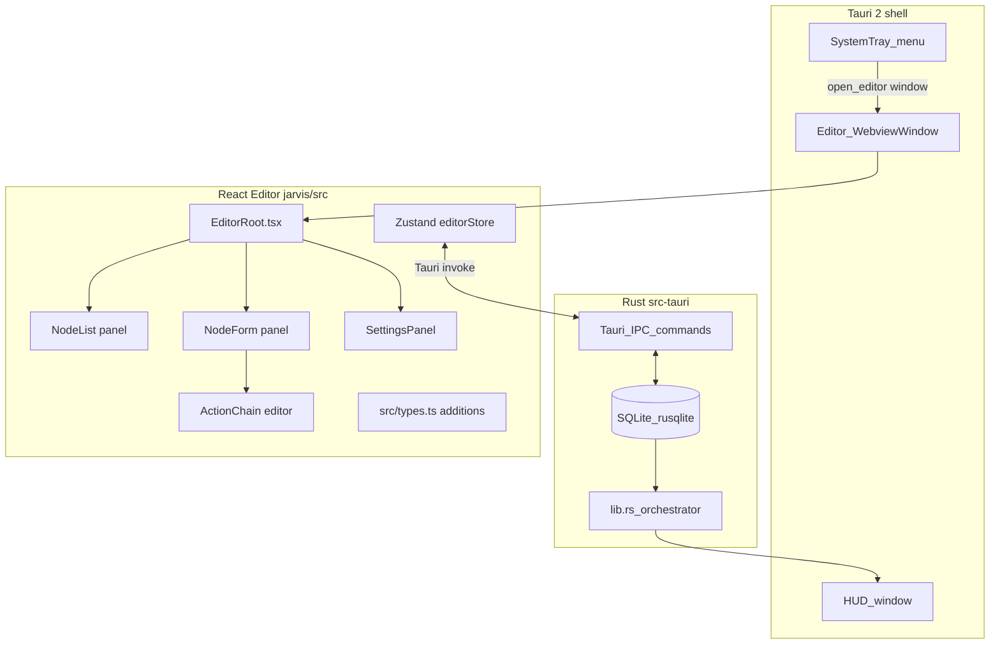

# Implementation Plan: JARVIS Phase 3 — React Command Editor

## Overview

Build the **React command editor** described in the SPEC and BrainStorm roadmap: a node-graph UI for creating, editing, and organizing command nodes — trigger phrases, ordered action chains, fuzzy-match thresholds, and optional `sub_prompt` branches. This phase assumes **Phase 1 MVP** (hotkey → HUD → Whisper → exact-match → SQLite → executor) and **Phase 2** (fuzzy matching, full action chains, Piper TTS) are complete and signed off.

**Phase 3 scope (from SPEC / plan.md roadmap):**
- React command editor (node graph, drag-and-drop, BrainStorm editor spec)
- `update_command` Tauri IPC command (deferred from Phase 1 Task 2)
- Editor entry point from the system tray
- Settings panel (theme, hotkeys, per-node thresholds)

**Resolved decisions carried forward:**
- DB: `rusqlite` (sync embedded). Editor uses same `CommandNode` / `Action` schema.
- Fuzzy threshold default: **0.80** per SPEC (per-node overridable — Phase 2 landed this).
- Window strategy: editor opens as a **separate named `WebviewWindow`** (not the HUD overlay) — persistent, resizable, taskbar-visible.
- Style: no emoji in editor per BrainStorm; geometric icons; shared **10px radius / 44px node height**.

---

## Architecture



**Key design rules:**
- Editor and HUD are **different windows** — no shared React tree, but they share `src/types.ts` and the same Rust DB.
- Editor uses **Tauri `invoke`** (request/response) for all DB operations; HUD uses **Tauri `emit/listen`** for streaming events. These patterns must not be mixed.
- `lib.rs` IPC commands for the editor: `create_command`, `update_command`, `delete_command`, `list_commands`, `get_command`. These are **synchronous, non-audio** commands.
- The live pipeline (audio/matcher/executor) must continue working while the editor is open — no shared mutable state with editor IPC calls except through DB.

---

## Dependency Graph

```
T3-1: Editor window + tray entry point         (shell layer — unblocks all UI work)
  |
  +---> T3-2: IPC: update_command + list/get   (data layer — completes Phase 1 deferred item)
  |       |
  |       +---> T3-3: NodeList panel            (read-only first, enables T3-4)
  |               |
  |               +---> T3-4: NodeForm + ActionChain editor
  |                       |
  |                       +---> T3-7: Integration + live-reload HUD
  |
  +---> T3-5: Settings panel                   (independent after T3-1, parallel with T3-3/4)
  |       |
  |       +---> T3-7
  |
  +---> T3-6: Drag-and-drop node reorder       (parallel after T3-3 renders list)
          |
          +---> T3-7

T3-7: Integration + smoke test                 (all of the above)
  |
  +---> T3-8: Quality gates + README update
```

---

## Tasks

---

### Task 3-1: Editor Window + Tray Entry Point [S]

**Description:**
Open a second named `WebviewWindow` (`"editor"`) when the user clicks **"Open Editor"** in the tray menu. The window is standard (decorated, resizable, taskbar-visible), **900×600px** minimum size, centered on primary monitor. If already open, focus it instead of creating a second instance (use `get_webview_window("editor").is_some()` guard). React entry: `EditorRoot.tsx` renders a placeholder `<div>Editor coming soon</div>` until later tasks fill it in. Add `"Open Editor"` item to the existing tray menu above "Pause / Resume".

**Acceptance criteria:**
- Clicking "Open Editor" in tray opens the editor window (decorated, resizable, taskbar entry).
- Clicking again while open focuses the existing window instead of duplicating.
- Window minimum size enforced: 900×600.
- HUD continues working while editor is open (verify hotkey still fires, HUD still appears).
- `EditorRoot.tsx` renders without errors; passes `npm run lint`.

**Verification:**
- Manual: open editor from tray, minimize, click tray again → focuses, not new window.
- Manual: while editor is open, fire hotkey → HUD still appears.
- `cargo clippy -- -D warnings` clean.

**Dependencies:** Phase 1 Task 8 (tray) — must be complete.

**Files:**
- `jarvis/src-tauri/src/lib.rs` (add `open_editor` command + window guard)
- `jarvis/src-tauri/src/tray.rs` (add "Open Editor" menu item)
- `jarvis/src-tauri/tauri.conf.json` (editor window definition)
- `jarvis/src-tauri/capabilities/default.json` (window-create permission if needed)
- `jarvis/src/EditorRoot.tsx` (new — placeholder)
- `jarvis/src/editorMain.tsx` (new — separate Vite entry for editor window)
- `jarvis/vite.config.ts` (add second entry point for editor)

---

### Task 3-2: IPC — `update_command` + Full CRUD Surface [S]

**Description:**
Complete the DB IPC layer deferred from Phase 1 Task 2. Add `update_command(id, node: CommandNode)` to `db/mod.rs` and expose it as a Tauri `#[command]`. Register all editor-facing commands in `lib.rs`: `list_commands`, `get_command`, `create_command`, `update_command`, `delete_command`. Each command returns `Result<T, String>` (Tauri pattern). Validate payloads on the Rust side: non-empty name, at least one trigger phrase, at least one action, threshold in `[0.0, 1.0]`. Write `cargo test db::update` and extend existing `db::` tests with round-trip for `update`.

**Acceptance criteria:**
- `update_command` persists name, trigger_phrases, actions, fuzzy_threshold changes to SQLite.
- All 5 IPC commands reachable from React via `invoke(...)`.
- Payload validation rejects: empty name → error string; zero trigger phrases → error string; threshold outside `[0.0, 1.0]` → error string.
- `cargo test db::` all green including new `update` test.
- No `unwrap()` in non-test Rust paths (clippy enforces).

**Verification:**
- `cd jarvis/src-tauri && cargo test db::`
- Manual devtools: `invoke("update_command", { id: 1, ... })` returns success.

**Dependencies:** Task 3-1 (editor window exists, gives a JS context to test invoke from); Phase 1 Task 2 (schema already exists).

**Files:**
- `jarvis/src-tauri/src/db/mod.rs` (add `update_command`, extend tests)
- `jarvis/src-tauri/src/lib.rs` (register all 5 IPC commands)
- `jarvis/src/types.ts` (add `CommandNodePayload` and `ActionPayload` editor-side types if not already present)

---

### Task 3-3: NodeList Panel [S–M]

**Description:**
Left panel of the editor: a scrollable list of all command nodes loaded via `invoke("list_commands")`. Each row shows: node name (bold), first trigger phrase (muted), enabled/disabled toggle (pill switch), delete button (trash icon, confirms before `invoke("delete_command", ...)`). Empty state: a centered "No commands yet — click + to add" message with a large `+` button. "New command" `+` button in the panel header clears the right panel form (T3-4) for a fresh node. On mount, store result in `editorStore`. Polling or manual refresh (not live event subscription) is acceptable for Phase 3 — the user controls the editor and pipeline simultaneously is rare.

Zustand `editorStore`: `nodes: CommandNode[]`, `selectedId: number | null`, `setSelected`, `setNodes`, `deleteNode`, `toggleEnabled`.

**Acceptance criteria:**
- List renders all seeded commands on first load.
- Enabled toggle calls `invoke("update_command", ...)` and optimistically updates local state; reverts on error with an inline error toast (no modal).
- Delete: confirmation prompt (browser `confirm()` is acceptable for MVP), calls `invoke("delete_command")`, removes from list.
- Empty state renders when list is empty.
- Selecting a row sets `editorStore.selectedId`; highlighted row style visible.
- `npm run lint` clean; no `any` without comment.

**Verification:**
- Manual: load editor, confirm seeded nodes appear.
- Manual: delete a node, refresh → gone from SQLite.
- Manual: toggle enabled → toggle survives editor close/reopen.
- `cd jarvis && npm run test` (Vitest: `editorStore` unit tests for `setNodes`, `deleteNode`).

**Dependencies:** Task 3-1 (window), Task 3-2 (IPC).

**Files:**
- `jarvis/src/components/Editor/NodeList.tsx` (new)
- `jarvis/src/store/editorStore.ts` (new — Zustand)
- `jarvis/src/EditorRoot.tsx` (wire NodeList into layout)
- `jarvis/src/components/Editor/NodeList.test.ts` (new — Vitest, store unit tests)

---

### Task 3-4: NodeForm + ActionChain Editor [M–L]

**Description:**
Right panel: form for creating and editing a `CommandNode`. Fields:
- **Name** (text input, required)
- **Trigger phrases** (tag-input: press Enter or comma to add a tag, click ×  to remove; at least one required)
- **Fuzzy threshold** (slider 0.50–1.00, step 0.01, shows numeric value; default 0.80)
- **Enabled** toggle
- **Action chain** — ordered list of actions (see below)
- **Save** / **Cancel** buttons; Save calls `create_command` (new) or `update_command` (existing).

**Action chain sub-editor:** Each action row is a card with a type selector dropdown and type-specific fields:

| Action type | Fields |
|---|---|
| `open_app` | App name (text) |
| `open_url` | URL (text, validates `https?://`) |
| `run_script` | Script path (text) |
| `send_keys` | Key sequence (text, e.g. `ctrl+c`) |
| `speak` | Text to speak (textarea, maps to Piper TTS) |
| `wait` | Duration ms (number input, min 100) |

Actions are reorderable via **drag-and-drop** (use `@dnd-kit/core` — ask before adding dep). Each row has an up/down arrow fallback for accessibility. Add / remove action rows with `+` / `×` buttons.

**sub_prompt support (Phase 3 scope):** An optional "Follow-up prompt" section below the action chain: a text field for `sub_prompt` text and a nested mini action chain (same components, depth = 1 only). If empty, `sub_prompt` is `null` in the DB.

**Form state:** Managed locally in component (not in `editorStore`) — `editorStore` holds server state; form holds draft. On save success: update `editorStore.nodes` optimistically, show inline success toast for 2s.

**Acceptance criteria:**
- All action types renderable and editable.
- Validation: name required, ≥1 trigger phrase, ≥1 action, valid URL for `open_url`, threshold in range — inline field errors, no save until valid.
- Drag-and-drop reorders action chain; order persists after save and re-load.
- `sub_prompt` field present; saves and reloads correctly.
- Selecting a node in NodeList populates the form; "New" clears it.
- `npm run lint` clean; Vitest unit tests for form validation logic.

**Verification:**
- Manual: create a new "open calculator" node, save, trigger via hotkey → Calculator opens.
- Manual: edit existing node trigger phrase, save → new phrase works immediately (no restart needed).
- Manual: drag action rows, save, reopen editor → order preserved.
- `cargo test db::` still green (action JSON round-trip).
- `npm run test` Vitest validation tests pass.

**Dependencies:** Task 3-3 (NodeList with selection); Task 3-2 (IPC).

**Files:**
- `jarvis/src/components/Editor/NodeForm.tsx` (new)
- `jarvis/src/components/Editor/ActionChain.tsx` (new)
- `jarvis/src/components/Editor/ActionCard.tsx` (new — single action row)
- `jarvis/src/components/Editor/NodeForm.test.ts` (new — Vitest validation)
- `jarvis/src/EditorRoot.tsx` (wire two-panel layout: NodeList + NodeForm)
- `jarvis/package.json` (add `@dnd-kit/core` — confirm before adding)

---

### Checkpoint A — Editor Foundation

All of the following must be true before proceeding to T3-5/T3-6:

- [ ] Editor window opens from tray; HUD unaffected.
- [ ] NodeList loads, deletes, and toggles nodes from live SQLite.
- [ ] NodeForm creates and edits all action types with validation.
- [ ] `update_command` IPC fully tested (`cargo test db::`).
- [ ] `npm run lint` and `cargo clippy -- -D warnings` both clean.
- Human sign-off required.

---

### Task 3-5: Settings Panel [S]

**Description:**
A tab or modal accessible from a gear icon in the editor header. Three sections for Phase 3:

1. **Hotkey** — display current global hotkey (`Ctrl+Shift+J`); input field to change it; calls a new `set_hotkey(combo: string)` Tauri command that re-registers the global shortcut. Persist to a `settings` table (id, key, value — simple key/value store) in SQLite.
2. **Default fuzzy threshold** — slider matching NodeForm's; updates global default used for nodes that haven't set their own.
3. **Theme** — `"dark"` / `"light"` / `"system"` selector; applies a CSS class to `<html>` in the editor window; persist to settings table.

`settings` table schema: `CREATE TABLE IF NOT EXISTS settings (key TEXT PRIMARY KEY, value TEXT NOT NULL)`.

**Acceptance criteria:**
- Hotkey change persists across app restart; new hotkey activates immediately (old one deregistered).
- Default threshold persists and is used by matcher when node threshold is `null`.
- Theme selector changes editor appearance immediately; persists across restart.
- Invalid hotkey (empty, or unregisterable combo) shows inline error, does not deregister current hotkey.
- `cargo test db::settings` covers insert/update/get round-trip.

**Verification:**
- Manual: change hotkey to `Ctrl+Shift+K`, close app, reopen → new hotkey works.
- Manual: toggle light/dark theme → editor re-renders; close/reopen → theme persists.
- `cargo test db::settings`.

**Dependencies:** Task 3-1 (editor window); Task 3-2 (IPC pattern established).

**Files:**
- `jarvis/src-tauri/src/db/settings.rs` (new — settings table, get/set helpers)
- `jarvis/src-tauri/src/db/mod.rs` (wire settings module)
- `jarvis/src-tauri/src/lib.rs` (add `get_setting`, `set_setting`, `set_hotkey` IPC commands)
- `jarvis/src/components/Editor/SettingsPanel.tsx` (new)
- `jarvis/src/EditorRoot.tsx` (add settings gear icon + panel toggle)

---

### Task 3-6: Drag-and-Drop Node Reorder in NodeList [S]

**Description:**
Allow reordering command nodes in the NodeList via drag-and-drop (same `@dnd-kit/core` dep as T3-4). Add a `sort_order INTEGER DEFAULT 0` column to `command_nodes` (migration: `ALTER TABLE command_nodes ADD COLUMN sort_order INTEGER DEFAULT 0`). Add `reorder_commands(ordered_ids: Vec<i64>)` Tauri IPC command that bulk-updates `sort_order`. `list_commands` returns nodes ordered by `sort_order ASC, id ASC`. NodeList renders drag handles (⠿ icon, leftmost, visible on hover).

**Schema migration note:** This is an additive `ALTER TABLE` — no data loss. Still: document in a `MIGRATIONS.md` file at `jarvis/src-tauri/` and ask before applying any future destructive migrations.

**Acceptance criteria:**
- Dragging nodes in NodeList reorders them; new order persists after editor close/reopen.
- `list_commands` consistently returns nodes in sort_order.
- `reorder_commands` covered by `cargo test db::reorder`.
- Migration runs automatically on app startup (before other DB operations).
- Drag handles visible on row hover; tab-accessible (up/down arrow keys as fallback).

**Verification:**
- Manual: reorder nodes, close editor, reopen → order preserved.
- Manual: fire hotkey → commands still match (pipeline unaffected by sort_order).
- `cargo test db::reorder`.

**Dependencies:** Task 3-3 (NodeList rendered); Task 3-2 (IPC pattern).

**Files:**
- `jarvis/src-tauri/src/db/mod.rs` (migration, `reorder_commands`)
- `jarvis/src-tauri/src/lib.rs` (register `reorder_commands`)
- `jarvis/src/components/Editor/NodeList.tsx` (add drag handles, dnd-kit integration)
- `jarvis/src-tauri/MIGRATIONS.md` (new — migration log)

---

### Checkpoint B — Full Editor Feature-Complete

All of the following must be true before T3-7:

- [ ] NodeList: renders, reorders, toggles, deletes.
- [ ] NodeForm: creates, edits, all action types, sub_prompt, drag-drop action chain.
- [ ] Settings: hotkey, threshold, theme — all persist.
- [ ] No `unwrap()` in non-test Rust paths; `cargo clippy -- -D warnings` clean.
- [ ] `npm run lint` and `npm run test` clean.
- Human sign-off required.

---

### Task 3-7: Integration — Live Pipeline Reload + Smoke Tests [M]

**Description:**
When the editor saves or deletes a command, the running audio/match pipeline must pick up the change **without restarting the app**. Currently the pipeline loads commands once at startup. Introduce a `CommandCache`: an `Arc<RwLock<Vec<CommandNode>>>` in `lib.rs`, loaded from DB on startup. Each editor IPC write command (create, update, delete, reorder) refreshes this cache after the DB write. The matcher in `lib.rs` reads from the cache (read lock, no DB query per transcript segment). Test this path: create a node in the editor → immediately trigger the hotkey → new command matches.

Also wire the live pipeline's `ai_mode` path (from SPEC Phase 4 preview, minimal): if `CommandNode.ai_mode == true` and `ANTHROPIC_API_KEY` env var is set, after the executor runs its actions, call `claude-haiku-4-5` with the node's `sub_prompt` text. Response emitted as a `transcript-update` (final) event so the HUD shows the AI response. **Gate strictly on `ai_mode: true` AND key present — no key → skip silently, log warning.**

**Acceptance criteria:**
- Create a node in the editor, immediately trigger it via hotkey (no app restart) → it executes.
- Delete a node → it no longer matches (no restart).
- `ai_mode: true` + key set: Haiku call fires, response appears in HUD.
- `ai_mode: true` + no key: silently skipped, no panic, warning logged.
- `ai_mode: false`: no API call regardless of key.
- API key never logged, never emitted over IPC.
- `cargo test` still fully green.

**Verification:**
- Manual: editor create → immediate hotkey trigger → executes.
- Manual: editor delete → hotkey → no match.
- Manual: `ai_mode` node with key set → HUD shows AI reply.
- `cargo test` full suite.

**Dependencies:** Tasks 3-4, 3-5, 3-6 (all editor features complete).

**Files:**
- `jarvis/src-tauri/src/lib.rs` (CommandCache, cache refresh on write, ai_mode branch)
- `jarvis/src-tauri/src/commands/executor.rs` (ai_mode call path)
- `jarvis/src-tauri/Cargo.toml` (add `reqwest` or `anthropic` crate for Haiku calls — ask first)
- `jarvis/src/store/editorStore.ts` (invalidate / refresh after save)

---

### Task 3-8: Quality Gates + README + BrainStorm Restore [S]

**Description:**
- Restore `BrainStorm.md` at repo root from git history or original spec session (required before Phase 4 wake-word work per plan.md note).
- Update `jarvis/README.md`: Phase 3 section — how to open the editor, keyboard shortcuts in editor, settings location, migration note.
- Verify `npm run lint`, `npm run test`, `cargo fmt --check`, `cargo clippy -- -D warnings` all clean.
- `npm run tauri build` produces `.exe` with editor window and correct bundled resources.
- Add Vitest coverage threshold config: **70%+ line coverage** on `editorStore`, NodeForm validation, ActionChain logic.

**Acceptance criteria:**
- `BrainStorm.md` present at repo root with full Phase 4 editor spec content.
- All quality gates pass: lint, test (≥70% coverage on editor modules), fmt, clippy.
- `npm run tauri build` succeeds, installer smoke-tested (open editor from tray, create command, trigger).
- README covers Phase 3 usage and editor keyboard shortcuts.

**Verification:**
- Clean clone → `cd jarvis && npm install` → fetch model → `npm run tauri build` → install → full E2E checklist (hotkey + HUD + editor create + trigger).

**Dependencies:** Task 3-7.

**Files:**
- `BrainStorm.md` (restore at repo root)
- `jarvis/README.md` (Phase 3 additions)
- `jarvis/vite.config.ts` (coverage thresholds)
- Minor cleanup across editor components as needed

---

### Checkpoint C — Phase 3 Complete

- [ ] All Phase 3 tasks merged and passing CI quality gates.
- [ ] Editor opens from tray; all CRUD operations work end-to-end.
- [ ] Pipeline live-reloads after editor saves (no app restart needed).
- [ ] `BrainStorm.md` restored.
- [ ] `npm run tauri build` produces installable `.exe` with full Phase 3 feature set.
- [ ] Human sign-off before Phase 4 (Porcupine/OpenWakeWord wake-word + Haiku `ai_mode` full integration).

---

## Risks and Mitigations

| Risk | Impact | Mitigation |
|---|---|---|
| `@dnd-kit` drag-and-drop conflicts with Tauri webview on Windows | Medium — DnD may mis-fire or block pointer events | Test early in T3-4; fallback to up/down arrow buttons if DnD is unreliable in the webview |
| Global hotkey re-registration race (T3-5) | Medium — old hotkey stays active or new one fails silently | Deregister before re-register; propagate Tauri plugin errors to UI |
| `Arc<RwLock<>>` cache contention (T3-7) | Low — editor writes are infrequent | Read lock per transcript segment is cheap; write lock only on editor save |
| `ALTER TABLE` migration on existing user DBs (T3-6) | Medium — app crashes if migration not idempotent | Wrap in `IF NOT EXISTS` / check-column-exists guard; test on a pre-Phase-3 DB file |
| BrainStorm.md missing (carry-forward from Phase 1) | Medium — Phase 4 editor spec unclear without it | T3-8 makes restoration a hard gate before Phase 4 starts |
| Anthropic Haiku API key in env on Windows (T3-7) | Medium — users may not know how to set env vars | Document in README; add a Settings panel field in a future patch (not Phase 3 scope) |

---

## Out of Scope for Phase 3

These belong to later phases per the SPEC roadmap:

- **Phase 4:** Porcupine / OpenWakeWord wake-word; full Haiku `ai_mode` settings UI; app auto-detection.
- **Phase 5:** Code signing, auto-updater, NSIS + DMG installers.
- Command sync / cloud (explicitly local-only, v1).
- Plugin system (keep executor modular but don't expose plugin API).
- macOS-specific testing (Windows MVP confirmed stable first; document any macOS gaps in release notes).

---

## References

- `SPEC.md` — tech stack, code style, success criteria, open questions.
- `plan.md` (Phase 1) — Phase 1 architecture, IPC contract, deferred items (update_command, BrainStorm.md).
- Phase 2 plan (assumed complete) — fuzzy matching, full action chains, Piper TTS.
- `BrainStorm.md` — **must be restored before Phase 4**; editor measurements to be confirmed against this doc when available.