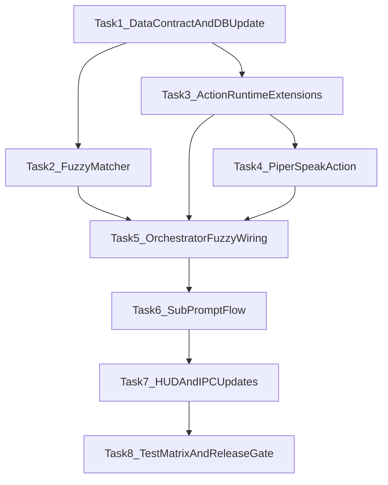

# Implementation Plan: JARVIS Phase 2

## Scope
Use [SPEC.md](SPEC.md) + [references/plan.md](references/plan.md) to deliver documented Phase 2: `rapidfuzz` fuzzy matching, expanded action chains (`run_script`, `send_keys`, `wait`, `speak`), and `sub_prompt` follow-up flow. Baseline Phase 1 impl already present in [jarvis/src-tauri/src/lib.rs](jarvis/src-tauri/src/lib.rs), [jarvis/src-tauri/src/commands/matcher.rs](jarvis/src-tauri/src/commands/matcher.rs), [jarvis/src-tauri/src/commands/executor.rs](jarvis/src-tauri/src/commands/executor.rs), [jarvis/src-tauri/src/db/models.rs](jarvis/src-tauri/src/db/models.rs), [jarvis/src/components/hud/HudPanel.tsx](jarvis/src/components/hud/HudPanel.tsx).

## Architecture decisions
- Match engine stays Rust-side; add fuzzy scorer behind matcher API (keep UI/TS contract stable first).
- `Action` enum remains JSON-serialized in SQLite; additive variants only (no destructive migration).
- `sub_prompt` implemented as orchestrator-managed mini-session (`AwaitingInput` phase) in [jarvis/src-tauri/src/lib.rs](jarvis/src-tauri/src/lib.rs).
- TTS is offline-first; Piper integration isolated in new audio/action module to avoid coupling with Whisper capture.

## Dependency graph

## Tasks (vertical slices)

### Task 1: Extend command data contract + update API
**Description:** Add Phase 2 action variants + per-node fuzzy config fields and `update_command` persistence path.

**Acceptance criteria:**
- [x] `Action` enum supports new variants: `RunScript`, `SendKeys`, `Wait`, `Speak`, `SubPrompt`.
- [x] DB CRUD includes `update_command` with round-trip tests.
- [x] Existing seeded commands remain readable after schema/model change.

**Verification:**
- [x] `cd jarvis/src-tauri && cargo test db::`
- [x] Backward-compat fixture test for pre-Phase-2 JSON action payload.

**Dependencies:** None (Phase 2 foundation).

**Files likely touched:**
- [jarvis/src-tauri/src/db/models.rs](jarvis/src-tauri/src/db/models.rs)
- [jarvis/src-tauri/src/db/mod.rs](jarvis/src-tauri/src/db/mod.rs)
- [jarvis/src/types.ts](jarvis/src/types.ts)

---

### Task 2: Fuzzy matcher slice (score + threshold)
**Description:** Introduce `rapidfuzz` matcher path with deterministic tie-break, per-node threshold (default `0.80`), and span extraction fallback.

**Acceptance criteria:**
- [x] Exact matches still succeed (no regression).
- [x] Near-phrase inputs match when score >= threshold.
- [x] Ambiguous ties resolve predictably (documented order).

**Verification:**
- [x] `cargo test commands::matcher`
- [x] Added tests for threshold boundary, tie-break, no-match.

**Dependencies:** Task 1.

**Files likely touched:**
- [jarvis/src-tauri/src/commands/matcher.rs](jarvis/src-tauri/src/commands/matcher.rs)
- [jarvis/src-tauri/Cargo.toml](jarvis/src-tauri/Cargo.toml)

---

### Task 3: Action runtime extensions (non-interactive chain)
**Description:** Implement non-interactive chain actions first (`RunScript`, `SendKeys`, `Wait`) in executor with strict validation/guardrails.

**Acceptance criteria:**
- [x] Actions run in declared order.
- [x] Validation rejects unsafe script/keys payloads with error events.
- [x] `Wait` pauses chain without blocking HUD event loop.

**Verification:**
- [x] `cargo test commands::executor`
- [ ] Manual smoke command chain: `open_app -> wait -> open_url`.

**Dependencies:** Task 1.

**Files likely touched:**
- [jarvis/src-tauri/src/commands/executor.rs](jarvis/src-tauri/src/commands/executor.rs)
- [jarvis/src-tauri/src/commands/mod.rs](jarvis/src-tauri/src/commands/mod.rs)
- [jarvis/src-tauri/src/lib.rs](jarvis/src-tauri/src/lib.rs)

---

### Checkpoint A (after Tasks 1-3)
- [ ] DB update path stable.
- [ ] Fuzzy match works with no exact-match regression.
- [ ] Extended non-interactive action chain executes deterministically.
- [ ] `cargo test` and `cargo clippy -- -D warnings` green.

---

### Task 4: `speak` action via Piper (offline TTS)
**Description:** Add Piper-backed speech action with caching/voice config hooks and robust missing-binary handling.

**Acceptance criteria:**
- [ ] `Speak` action emits audible output on Windows dev environment.
- [x] Missing Piper runtime/model emits controlled error event, no panic.
- [x] `Speak` composes in chain with other actions.

**Verification:**
- [x] `cargo test commands::executor` (mock runtime for speak path)
- [ ] Manual command with `Speak` action.

**Dependencies:** Task 3.

**Files likely touched:**
- [jarvis/src-tauri/src/commands/executor.rs](jarvis/src-tauri/src/commands/executor.rs)
- [jarvis/src-tauri/src/audio](jarvis/src-tauri/src/audio)
- [jarvis/src-tauri/Cargo.toml](jarvis/src-tauri/Cargo.toml)
- [jarvis/README.md](jarvis/README.md)

---

### Task 5: Orchestrator wiring for fuzzy + chain observability
**Description:** Wire new matcher outputs and executor statuses into main pipeline; preserve cancel/timeout semantics.

**Acceptance criteria:**
- [x] Transcript finalization triggers fuzzy match path.
- [x] Action status/error events stream through full chain.
- [x] Stop/Esc cancellation still aborts active run safely.

**Verification:**
- [x] `cargo test` for `lib.rs` orchestration logic
- [ ] Manual: fuzzy phrase triggers multi-step chain end-to-end.

**Dependencies:** Tasks 2-4.

**Files likely touched:**
- [jarvis/src-tauri/src/lib.rs](jarvis/src-tauri/src/lib.rs)
- [jarvis/src-tauri/src/hud.rs](jarvis/src-tauri/src/hud.rs)

---

### Task 6: `sub_prompt` follow-up flow (`AwaitingInput`)
**Description:** Implement interactive branch action: executor requests follow-up phrase, orchestrator enters `AwaitingInput`, resumes chain with follow-up match/context.

**Acceptance criteria:**
- [x] `SubPrompt` transitions HUD to `awaiting_input` and waits for follow-up input.
- [x] Follow-up timeout + cancel path returns to safe terminal phase.
- [x] Follow-up response can influence next chain step deterministically.

**Verification:**
- [x] New orchestration tests for follow-up happy/timeout/cancel paths.
- [ ] Manual voice flow with at least one branching command.

**Dependencies:** Task 5.

**Files likely touched:**
- [jarvis/src-tauri/src/lib.rs](jarvis/src-tauri/src/lib.rs)
- [jarvis/src-tauri/src/commands/executor.rs](jarvis/src-tauri/src/commands/executor.rs)
- [jarvis/src/types.ts](jarvis/src/types.ts)

---

### Checkpoint B (after Tasks 4-6)
- [ ] `Speak` + `SubPrompt` both functional in same run.
- [ ] HUD phase machine stable under cancel/timeouts.
- [ ] No deadlocks/resource leaks on repeated runs.

---

### Task 7: HUD + IPC updates for Phase 2 semantics
**Description:** Update reducer/panel rendering for fuzzy confidence cues (if exposed), awaiting-input messaging, and richer action-chain progress/errors.

**Acceptance criteria:**
- [x] HUD clearly distinguishes `listening`, `matched`, `awaiting_input`, `executing`, `done`, `stopped` for new flows.
- [x] Follow-up prompt text and terminal errors are user-visible.
- [x] Existing keyboard controls (`Esc`) remain identical behavior.

**Verification:**
- [x] `npm test` for reducer/panel logic
- [ ] Manual scripted phase demo with mocked + real IPC.

**Dependencies:** Task 6.

**Files likely touched:**
- [jarvis/src/store/hudReducer.ts](jarvis/src/store/hudReducer.ts)
- [jarvis/src/store/hudStore.ts](jarvis/src/store/hudStore.ts)
- [jarvis/src/store/hudIpc.ts](jarvis/src/store/hudIpc.ts)
- [jarvis/src/components/hud/HudPanel.tsx](jarvis/src/components/hud/HudPanel.tsx)

---

### Task 8: Test matrix + release gate for Phase 2
**Description:** Finalize test coverage and manual checklist for fuzzy/action/sub-prompt behaviors; update docs for setup and known limits.

**Acceptance criteria:**
- [ ] Rust unit/integration tests cover matcher, DB update, executor variants, sub_prompt orchestration.
- [ ] Frontend tests cover reducer/UI handling of awaiting_input and action errors.
- [ ] Phase 2 manual checklist added and reproducible on Windows.

**Verification:**
- [ ] `cd jarvis/src-tauri && cargo test && cargo clippy -- -D warnings`
- [ ] `cd jarvis && npm run test && npm run build`
- [ ] Manual checklist pass for 5 core scenarios.

**Dependencies:** Task 7.

**Files likely touched:**
- [references/todo.md](references/todo.md)
- [jarvis/README.md](jarvis/README.md)
- Rust/TS test files alongside touched modules

---

## Risks and mitigations
- Piper runtime packaging risk → isolate `Speak` behind clear runtime error + doc install path first.
- Fuzzy false-positives risk → per-node threshold + deterministic tie-break + test corpus.
- Sub-prompt complexity risk → strict timeout/cancel defaults before adding advanced branching.
- Security risk in script/keys actions → explicit allowlist validation and reject-by-default behavior.

## Parallelization opportunities
- After Task 1 lands, Task 2 (matcher) and Task 3 (executor non-interactive) can run in parallel.
- Task 7 (HUD/IPC polish) can start once Task 6 event contract stabilizes.

## Exit criteria (Phase 2 done)
- At least one fuzzy-triggered multi-action chain runs end-to-end.
- `Speak` and `SubPrompt` both proven in manual flow.
- `update_command` available for future editor integration.
- Tests/docs updated, Windows acceptance run complete.