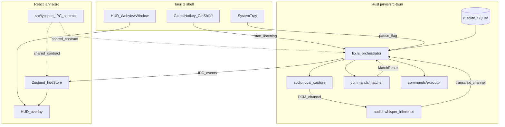

# Implementation Plan: JARVIS Phase 1 MVP

## Overview

Implement the MVP slice from [SPEC.md](../SPEC.md): a **Tauri 2** app under `**jarvis/`** (Windows-first), **global hotkey** (`Ctrl+Shift+J`) → glass **HUD** → **mic** → **Whisper.cpp** (`tiny.en`) → **live transcript** on HUD → **exact-match** against **SQLite** command nodes → `**open_app` / `open_url`**. **System tray**: pause/resume listening, quit.

**Resolved decisions:**

- **SQLite:** `rusqlite` (sync embedded).
- **Whisper model:** **Bundled** via Tauri `bundle.resources`; `ggml-tiny.en.bin` not committed — fetched by `jarvis/scripts/download-model.ps1` into `jarvis/src-tauri/resources/` before build.
- **Default hotkey:** `Ctrl+Shift+J`.

**Layout:** All app code under `jarvis/`. Run `npm` / `tauri` from `jarvis/`; raw `cargo` from `jarvis/src-tauri/`.

> **Note:** `BrainStorm.md` is not currently in the repo. Critical HUD measurements are inlined into Task 6 below. Restore the file from git history or the original spec session before Phase 2 editor work.

---

## Architecture




**Key design rule:** `audio`, `commands/matcher`, and `commands/executor` are pure logic modules. They never call each other directly. `lib.rs` orchestrates all data flow between them via channels and function calls.

**IPC contract** (`src/types.ts`): `TranscriptUpdate { text, is_final }`, `MatchResult { node_id, matched_phrase, span_start, span_end }`, `ActionStatus { text }`, `HudPhase = "idle" | "listening" | "matched" | "executing" | "awaiting_input" | "done" | "stopped"`.

**Tauri 2 capabilities** (required, not optional): `src-tauri/capabilities/default.json` must declare `global-shortcut:allow-register`, `shell:allow-open` (for `open_url`), and window management permissions. Without these the Tauri 2 build will silently refuse the operations at runtime.

---

## Dependency graph

```
T1: Scaffold + IPC types contract
  |
  +---> T2: SQLite + Action enum + CRUD + seeds   (foundation data layer)
  |       |
  |       +---> T5: Exact matcher
  |               |
  |               +---> T7: Executor
  |                       |
  |                       +---> T9: Integration
  |
  +---> T3: Hotkey + HUD window + click-through    (shell + window)
  |       |
  |       +---> T6: HUD UI   (uses src/types.ts contract — parallel with T4a/T4b)
  |               |
  |               +---> T9
  |
  +---> T4a: Mic capture (cpal)                    (audio track, split for risk)
  |       |
  |       +---> T4b: Whisper inference + model
  |               |
  |               +---> T9
  |
  +---> T8: System tray                            (independent, any time after T1)
          |
          +---> T9
```

---

## Tasks

### Task 1: Scaffold `jarvis/` + IPC types contract [S–M]

**Description:** Bootstrap `jarvis/` via `create-tauri-app` (React, TypeScript, Vite). Add frontend deps (`zustand`, `framer-motion`), Rust deps (`rusqlite`, `serde`, `thiserror`). Create `src/types.ts` with the full IPC contract (types for all events and `HudPhase`). Create `src-tauri/capabilities/default.json` stub with all required permissions. Configure `.gitignore` at the **repo root** covering `jarvis/node_modules/`, `jarvis/src-tauri/target/`, `jarvis/src-tauri/resources/*.bin`.

**Acceptance criteria:**

- `cd jarvis && npm run tauri dev` opens window on Windows.
- `cd jarvis/src-tauri && cargo test` passes (placeholder OK).
- `src/types.ts` exports `HudPhase`, `TranscriptUpdate`, `MatchResult`, `ActionStatus`.
- `src-tauri/capabilities/default.json` exists with `global-shortcut:allow-register` and `shell:allow-open`.
- Root `.gitignore` excludes `*.bin`, `target/`, `node_modules/`, `.env`.

**Verification:**

- `cd jarvis && npm run tauri dev` — window appears.
- `cd jarvis/src-tauri && cargo clippy -- -D warnings` clean.
- `cd jarvis && npm run build` succeeds.

**Dependencies:** None.

**Files:**

- `jarvis/package.json`, `jarvis/vite.config.`*, `jarvis/tsconfig.json`
- `jarvis/src/main.tsx`, `jarvis/src/App.tsx`, `jarvis/src/types.ts` (new)
- `jarvis/src-tauri/Cargo.toml`, `jarvis/src-tauri/src/main.rs`, `jarvis/src-tauri/src/lib.rs`
- `jarvis/src-tauri/tauri.conf.json`, `jarvis/src-tauri/capabilities/default.json` (new)
- `.gitignore` (repo root)

---

### Task 2: SQLite schema + `Action` type + CRUD + seeds [S]

**Description:** `jarvis/src-tauri/src/db/`: define `command_nodes` table (id, name, trigger_phrases JSON, actions JSON, enabled, created_at). Define the shared `Action` enum in `db/models.rs` — `Action::OpenApp { name, path }` and `Action::OpenUrl { url }` — serialized to/from JSON in the DB. Implement `init_db`, `insert_command`, `get_all_commands`, `get_command_by_id`, `delete_command`. Add seed data insertion on first init (if table is empty: "open notepad" → `open_app`, "open github" → `open_url`). Note `update_command` as **deferred** (Phase 2 when editor lands) — no schema migration needed now.

**Acceptance criteria:**

- DB created at Tauri app data dir on startup.
- `Action` enum serializes/deserializes round-trip via `serde_json`.
- Insert / list / get / delete all covered by `cargo test db::`.
- Seeds present on first run, not duplicated on subsequent runs.

**Verification:** `cd jarvis/src-tauri && cargo test db::`

**Dependencies:** Task 1.

**Files:**

- `jarvis/src-tauri/src/db/mod.rs` (new)
- `jarvis/src-tauri/src/db/models.rs` (new — `CommandNode`, `Action` enum, seeds)
- `jarvis/src-tauri/src/lib.rs` (wire module)

---

### Task 3: Global hotkey + HUD window + click-through [M]

**Description:** Register `Ctrl+Shift+J` via Tauri global shortcut plugin. On trigger: create or show a `WebviewWindow` — transparent, borderless (`decorations: false`), `always_on_top: true`, skip taskbar, **480px wide, min 120px height** (auto-expands with content), centered on primary monitor. When HUD phase is `idle` / `done` / `stopped`: call `window.set_ignore_cursor_events(true)` (click-through). When `listening` or `executing`: `set_ignore_cursor_events(false)`. Escape closes HUD (same code path as `stopped`). React: minimal dark glass shell.

**Acceptance criteria:**

- Hotkey works from any focused foreground app.
- Window is transparent, no title bar, no taskbar entry, always on top.
- Min height 120px; width 480px fixed.
- Click-through active when HUD is in `idle`/`done`/`stopped` phase.
- Escape dismisses HUD.

**Verification:** Manual on Windows — hotkey from another app, Esc, click-through when idle (clicks pass to desktop).

**Dependencies:** Task 1.

**Files:**

- `jarvis/src-tauri/src/lib.rs` (hotkey, window creation, click-through)
- `jarvis/src-tauri/tauri.conf.json` (window config)
- `jarvis/src-tauri/capabilities/default.json` (shortcut permissions)
- `jarvis/src/App.tsx` (HUD root)
- `jarvis/src/components/HUD/HudOverlay.tsx` (new — glass shell)
- `jarvis/src/index.css` (transparent body, base styles)

---

### Checkpoint A — Foundation

- `npm run tauri dev` works; hotkey shows/hides HUD; click-through verified.
- DB CRUD tests green; seeds exist on first run.
- `cargo clippy -- -D warnings` clean.

---

### Task 4a: Mic capture — `cpal` [S–M]

**Description:** `jarvis/src-tauri/src/audio/capture.rs`: start mic input stream via `cpal` (WASAPI on Windows), buffer PCM f32 samples into fixed-size chunks, send over a `std::sync::mpsc` channel to the inference thread. Also emit normalized amplitude (0.0–1.0) for waveform visualization — send via Tauri event `amplitude-update`. Expose `start_capture(tx: Sender<Vec<f32>>)` and `stop_capture()` functions; no Whisper dependency here.

**Acceptance criteria:**

- Mic opens and closes cleanly (no resource leak on stop/restart).
- PCM chunks flow through the channel at expected rate.
- `amplitude-update` events fire during capture (verifiable in devtools).
- Graceful error (log + event) if no mic device found.

**Verification:** `cargo test audio::capture` for unit-testable parts; manual devtools check for `amplitude-update` events.

**Dependencies:** Task 1.

**Files:**

- `jarvis/src-tauri/src/audio/mod.rs` (new)
- `jarvis/src-tauri/src/audio/capture.rs` (new)
- `jarvis/src-tauri/Cargo.toml` (add `cpal`)
- `jarvis/src-tauri/src/lib.rs` (wire module, register command)

---

### Task 4b: Whisper inference + bundled model [M]

**Description:** `jarvis/src-tauri/src/audio/stt.rs`: spawn dedicated inference thread, receive PCM chunks from T4a channel, accumulate into a buffer, run `whisper-rs` inference. Emit `transcript-update` (matches `TranscriptUpdate` type from `src/types.ts`) for partial and final segments. Resolve model path from `tauri::api::path::resource_dir()` + `ggml-tiny.en.bin`. Add `bundle.resources` to `tauri.conf.json`. Write `jarvis/scripts/download-model.ps1` (fetches from Hugging Face / ggerganov releases, saves to `jarvis/src-tauri/resources/`).

> **Windows build prerequisite:** `whisper-rs` requires **CMake** and **MSVC** (Visual Studio Build Tools). Document in `jarvis/README.md` before this task ships.

**Acceptance criteria:**

- Inference runs on dedicated thread; UI thread never blocks on Whisper.
- Model loads from bundled resource path in both `tauri dev` and `tauri build`.
- `transcript-update` events emitted with correct shape (`{ text, is_final }`).
- Missing model: error event emitted, no panic.
- `jarvis/scripts/download-model.ps1` exists and downloads the correct file.
- `tauri.conf.json` has `bundle.resources` entry for `ggml-tiny.en.bin`.

**Verification:** `cargo test audio::stt` for pure logic; manual speak → check `transcript-update` events in devtools.

**Dependencies:** Task 4a.

**Files:**

- `jarvis/src-tauri/src/audio/stt.rs` (new)
- `jarvis/src-tauri/Cargo.toml` (add `whisper-rs`)
- `jarvis/src-tauri/tauri.conf.json` (`bundle.resources`)
- `jarvis/src-tauri/resources/.gitkeep` (new — keep dir, exclude `*.bin`)
- `jarvis/scripts/download-model.ps1` (new)
- `jarvis/README.md` (prereqs: CMake, MSVC, model fetch step)

---

### Checkpoint B — Audio pipeline

- Mic capture flows PCM; amplitude events visible.
- Whisper emits transcript from live speech.
- `cargo test` green for `audio::`.

---

### Task 5: Exact-match command matcher [S]

**Description:** `jarvis/src-tauri/src/commands/matcher.rs`: given transcript text + slice of `CommandNode`s loaded from DB, find first node whose any trigger phrase appears as a case-insensitive substring in the transcript. Return `Option<MatchResult>` with node id, matched phrase, and byte span `(start, end)` for HUD highlight. No dependency on audio module.

**Acceptance criteria:**

- Case-insensitive substring match.
- Multiple trigger phrases per node all checked; first match wins.
- Returns `None` on no match.
- Tests: match, no-match, multi-phrase, case variants, span indices correct.

**Verification:** `cd jarvis/src-tauri && cargo test commands::matcher`

**Dependencies:** Task 2 (needs `CommandNode` + `Action` types).

**Files:**

- `jarvis/src-tauri/src/commands/mod.rs` (new)
- `jarvis/src-tauri/src/commands/matcher.rs` (new)

---

### Task 6: HUD UI — transcript, waveform, stop, state machine [M]

**Description:** Implement HUD React components. Zustand store subscribes to Tauri events using types from `src/types.ts` (established in T1, independent of T4a/T4b implementation). During development, drive with mocked events. **HUD spec (from BrainStorm — inlined here for self-containment):**

- **Transcript:** 22px, centered, near-white. Streams word-by-word. On match: matched span gets background highlight + scale 1.0→1.05 + translateY −4px over 200ms ease-out. Surrounding text fades opacity→0 over 300ms. Then matched text fades. Execution phase: action status text fades in, same font/position, no icons.
- **Waveform circle:** bottom-left, 44px diameter. 7 bars, 3px wide, 3px gap, centered. Pulses to `amplitude-update` values during `listening`. Bars animate to flat then circle fades on stop.
- **Stop button:** bottom-right, 38px diameter, filled square 11×11px centered. Resting: muted red fill + red border. Listening: border pulses opacity 0.4→1.0, 1.5s cycle. Hover: full red fill, no pulse. Below icon: `9px` mono shortcut label (e.g. `Esc`). Click = same code path as Escape = `stopped` transition.
- **Auto-dismiss:** `done` state → 300ms pause → panel fades. `stopped` → 150ms fade.
- **Click-through:** HUD component notifies Rust (via `set_ignore_cursor_events`) when phase changes to/from idle.

**Acceptance criteria:**

- All 6 phase transitions (`listening → matched → executing → awaiting_input → done / stopped`) animate correctly with mocked events.
- Waveform responds to `amplitude-update` events.
- Stop/Esc identical code path.
- Click-through toggled correctly on phase change.

**Verification:** Manual mock-event demo cycling all states.

**Dependencies:** Task 3 (window shell); `src/types.ts` from Task 1 (no T4 blocking).

**Files:**

- `jarvis/src/components/HUD/HudOverlay.tsx`
- `jarvis/src/components/HUD/Transcription.tsx` (new)
- `jarvis/src/components/HUD/WaveformCircle.tsx` (new)
- `jarvis/src/components/HUD/StopButton.tsx` (new)
- `jarvis/src/store/hudStore.ts` (new — Zustand, subscribes to Tauri events)
- `jarvis/src/types.ts` (use existing from T1)

---

### Task 7: Executor — `open_app` + `open_url` [S]

**Description:** `jarvis/src-tauri/src/commands/executor.rs`: given a `CommandNode`, iterate `actions` in order. `OpenApp`: Windows — `std::process::Command::new("cmd").args(["/C", "start", "", &name])`. `OpenUrl`: Tauri shell plugin `tauri_plugin_shell::open()`. After each action, emit `action-status` event (`ActionStatus { text: "Opening Discord..." }`). Validate IPC payloads: reject paths with shell metacharacters, only allow `https://` or `http://` URLs. On error: emit error event, continue remaining actions (don't crash).

**Acceptance criteria:**

- `OpenApp("notepad")` launches Notepad on Windows.
- `OpenUrl("https://github.com")` opens in default browser.
- `action-status` events fire for each action.
- Shell-metacharacter path rejected without panic.
- `shell:allow-open` declared in `capabilities/default.json`.

**Verification:** `cargo test commands::executor` (mockable paths); manual Notepad + URL.

**Dependencies:** Task 5 (needs `Action` / `CommandNode` types).

**Files:**

- `jarvis/src-tauri/src/commands/executor.rs` (new)
- `jarvis/src-tauri/Cargo.toml` (add `tauri-plugin-shell`)
- `jarvis/src-tauri/capabilities/default.json` (add `shell:allow-open`)

---

### Task 8: System tray — pause / resume / quit [S]

**Description:** Tauri tray plugin + menu: "Pause Listening" / "Resume Listening" (label toggles). Pause sets an `Arc<AtomicBool>` `is_paused` flag shared with the pipeline in `lib.rs`. On hotkey trigger, pipeline checks flag before starting mic capture. Quit calls `std::process::exit(0)` (or Tauri app handle exit).

**Acceptance criteria:**

- Tray icon appears at app launch.
- Pause prevents hotkey from activating mic; Resume restores.
- Menu label toggles correctly.
- Quit exits process.

**Verification:** Manual.

**Dependencies:** Task 1.

**Files:**

- `jarvis/src-tauri/src/tray.rs` (new)
- `jarvis/src-tauri/src/lib.rs` (wire tray, shared `is_paused` flag)
- `jarvis/src-tauri/tauri.conf.json` (tray config)
- `jarvis/src-tauri/icons/` (tray icon)

---

### Checkpoint C — Vertical features

- Audio + transcript events working (T4a + T4b).
- Matcher + executor unit tests green.
- HUD state transitions visually correct with mocked events.
- Tray pause/resume/quit works.

---

### Task 9: End-to-end pipeline integration [M]

**Description:** Wire `lib.rs` orchestrator: hotkey → check `is_paused` → show HUD + start T4a capture → PCM → T4b inference → `transcript-update` events → run matcher against DB nodes after each final segment → on `MatchResult`, emit `match-result` event + stop mic → executor runs action chain → emit `action-status` events → auto-dismiss HUD after **4s** (post-command completion timeout, per BrainStorm). Separate: **no-match timeout** after **5s** of listening without a match — dismiss HUD. Stop button / Escape cancel immediately (150ms fade). Pause (tray) gate already in T8 flag.

**Acceptance criteria:**

- Hotkey → speak "open notepad" → Notepad opens → HUD dismisses after 4s.
- Hotkey → speak "open github" → browser opens GitHub → HUD dismisses after 4s.
- Speak nonsense for 5s → HUD dismisses gracefully, no crash.
- Stop button cancels pipeline mid-flight.
- Tray pause prevents pipeline from starting.
- `cargo test` + `npm run build` still clean.

**Verification:** Manual E2E checklist in [todo.md](./todo.md).

**Dependencies:** Tasks 4a, 4b, 5, 6, 7, 8.

**Files:**

- `jarvis/src-tauri/src/lib.rs` (orchestration, timeouts, event wiring)
- `jarvis/src-tauri/src/audio/mod.rs` (integration hooks)
- `jarvis/src-tauri/src/commands/mod.rs` (pipeline fn)
- `jarvis/src/store/hudStore.ts` (wire real events, remove mocks)
- `jarvis/src/components/HUD/HudOverlay.tsx` (final state wiring)

---

### Task 10: Quality gates + clean-install verification [S]

**Description:** Add `npm run lint` (ESLint if not present from scaffold), `npm run test` (Vitest stub), `cargo fmt --check`, `cargo clippy`. Update `jarvis/README.md`: prerequisites (CMake, MSVC, Node LTS, Rust stable), model fetch step (`scripts/download-model.ps1`), `cd jarvis` convention. Verify `npm run tauri build` produces an installable `.exe` from a clean state (seeds already exist from Task 2).

**Acceptance criteria:**

- `cargo fmt --check` clean.
- `cargo clippy -- -D warnings` clean.
- `npm run lint` clean.
- `npm run tauri build` produces `.exe`.
- CI-friendly command sequence documented in README.

**Verification:** Clean clone → fetch model → build → install → E2E checklist.

**Dependencies:** Task 9.

**Files:**

- `jarvis/README.md`
- `jarvis/.eslintrc.`* (if missing from scaffold)
- Minor `jarvis/src-tauri/src/lib.rs` cleanup if needed

---

### Checkpoint D — MVP complete (SPEC Phase 1)

- All 5 SPEC MVP acceptance criteria met on Windows.
- Clean-install build produces `.exe` and seeds work end-to-end.
- All tests pass; lints clean.
- Human sign-off before Phase 2 (fuzzy matching, action chains, Piper TTS, `sub_prompt`).

---

## Risks and mitigations


| Risk                                       | Impact                         | Mitigation                                                                                                 |
| ------------------------------------------ | ------------------------------ | ---------------------------------------------------------------------------------------------------------- |
| `whisper-rs` + CMake + MSVC on Windows     | High — build fails             | Document prereqs before T4b; validate CMake early; if blocked, try `whisper-rs` with bundled build feature |
| Tauri 2 capabilities silent failures       | High — features silently no-op | Set up capabilities in T1; test each capability permission in its own task                                 |
| Transparent window quirks (Win10 vs Win11) | Medium                         | Test both; fallback to near-opaque if DWM compositor unavailable                                           |
| `cpal` WASAPI mic permission on Windows    | Medium                         | Test mic access in T4a before T4b; Tauri's OS permission flow                                              |
| Whisper inference latency on weak hardware | Medium — spec says <400ms      | `tiny.en` targets this; document hardware note; off UI thread per design                                   |


---

## Later phases (out of scope for this plan)

- **Phase 2:** `rapidfuzz` fuzzy matching, full action chains (`run_script`, `send_keys`, `speak` via Piper TTS, `sub_prompt`, `wait`).
- **Phase 3:** React command editor (node graph, drag-and-drop, BrainStorm editor spec).
- **Phase 4:** Porcupine / OpenWakeWord wake-word; Haiku `ai_mode`; app auto-detection.
- **Phase 5:** Code signing, auto-updater, Windows NSIS + macOS DMG installers.

---

## References

- [SPEC.md](../SPEC.md) — MVP acceptance criteria, layout, commands, code style.
- `BrainStorm.md` — **missing from repo**; HUD measurements inlined into Task 6 above. Restore before Phase 3 editor work.

